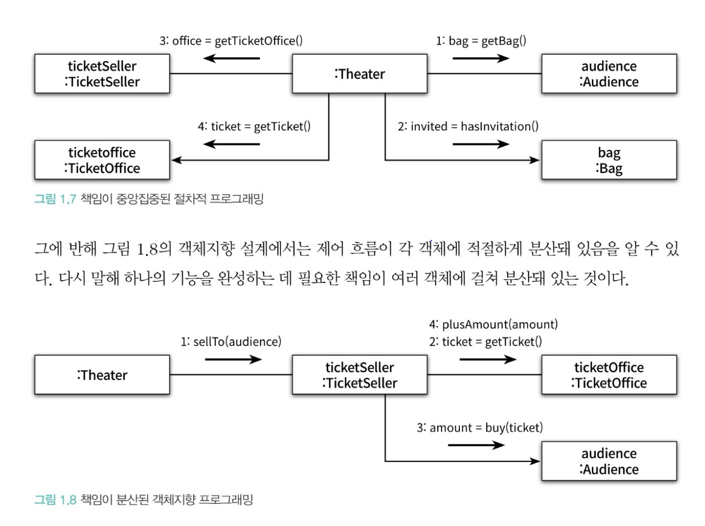
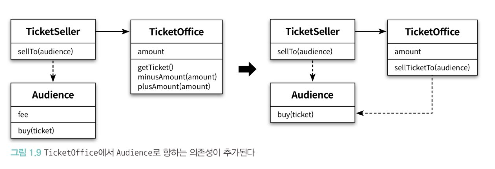

- 리팩토링 전에는 Theater가 전체 작업을 도맡아 했었다
- 리팩토링 후에는 각 객체가 자신이 맡은 일을 스스로 처리했다.

 
 

- code._01_theatre.TicketOffice 클래스도 캡슐화를 시도했으나 이로 인해 Audience에 대한 결합도가 증가했다.
- 캡슐화를 통한 의존성 ↓ VS Audience에 대한 결합도 ↓
- 이 트레이드오프에 대한 고민 끝에 Audience에 대한 결합도를 낮춘 상태를 유지하는 것으로 합의했다.
